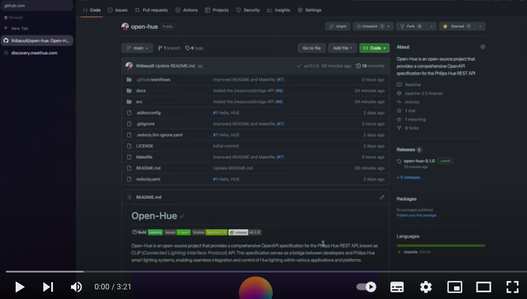

# Open-Hue
[](https://github.com/thibauult/open-hue/actions/workflows/build.yml)
[](https://github.com/thibauult/open-hue/issues)

[](https://github.com/thibauult/open-hue/blob/main/LICENSE)
[](https://github.com/thibauult/open-hue/releases/latest)

Open-Hue is an open-source project that provides a comprehensive OpenAPI specification for the Philips Hue REST API, known as CLIP (_Connected Lighting Interface Protocol_) API.
This specification serves as a bridge between developers and Philips Hue smart lighting systems, enabling seamless integration
and control of Hue lighting within various applications and platforms.


> 🚀 Open-Hue has just taken off, and you can follow the roadmap progression from our [Discussions](https://github.com/thibauult/open-hue/discussions/11) space
> in GitHub!

## Introduction
The Philips Hue lighting system is renowned for its versatility and convenience in home and commercial lighting solutions.
However, developers often face challenges when attempting to interact with Hue devices programmatically due to the complexity
of the underlying REST API. Open-Hue aims to simplify this process by offering a well-structured and fully-documented OpenAPI specification.

With Open-Hue, developers can:
- **Effortlessly Integrate Philips Hue**: Open-Hue provides a clear and standardized way to connect your applications and services with Philips Hue smart lighting, allowing for easy automation, customization, and remote control of lighting scenes and individual bulbs.
- **Enhance User Experiences**: By integrating Open-Hue into your projects, you can create innovative lighting experiences that respond to user interactions, environmental conditions, or specific events, enhancing user comfort and ambiance.
- **Save Development Time**: Avoid the complexities of reverse-engineering the Philips Hue API. Open-Hue eliminates the need for developers to decipher the API's intricacies and reduces development time, enabling faster implementation of Hue-related features.

## Usage

[](https://youtu.be/wMsKOpvBEp0)

To use the Open-Hue OpenAPI specification in your projects, you can obtain it from our GitHub releases. Here's how:

### Obtain the OpenAPI Specification

1. Visit our [GitHub releases page](https://github.com/thibauult/open-hue/releases).
2. Select the desired release version that suits your needs. Each release contains the complete OpenAPI specification for Open-Hue.
3. Download the `open-hue.yaml` file from the selected release. This YAML file represents the OpenAPI specification, which defines the structure and behavior of the Open-Hue API.

### Integration with Postman

You can easily import the OpenAPI specification into Postman, a popular API development and testing tool. Here's how:

1. Open Postman and click on the "Import" button in the top-left corner of the application.
2. Select "API schema" as the import type.
3. Upload the `open-hue.yaml` file that you downloaded from the Open-Hue release.
4. Postman will automatically generate a collection based on the OpenAPI specification, allowing you to make requests to the Open-Hue API with ease.

### Generate Client Code

The OpenAPI specification `open-hue.yaml` can be used to generate client code in virtually any programming language. There are various tools and libraries available that can take the specification and generate client code tailored to your language of choice.

Here's a basic example using the [`openapi-generator-cli`](https://github.com/OpenAPITools/openapi-generator-cli) to generate a Python client:

```bash
npx @openapitools/openapi-generator-cli generate -g python -i path/to/open-hue.yaml -o output/directory
```
Replace _path/to/open-hue.yaml_ with the actual path to your downloaded `open-hue.yaml` file and _output/directory_ with your desired output directory.

By following these steps, you can integrate Open-Hue's OpenAPI specification into your development workflow,
test the API using Postman, and generate client code in your preferred programming language.

## Getting Started

To begin developing with Open-Hue's OpenAPI specification, follow these steps:

### Prerequisites
Before you start, ensure that you have the following prerequisites installed:

- **Node.js and NPM**: Open-Hue relies on Node.js and NPM for certain tasks. Make sure you have them installed. You can download them from the official website: [Node.js](https://nodejs.org/).

### Fork the Repository
Before contributing to Open-Hue, it's a good practice to [fork](https://github.com/thibauult/open-hue/fork) the repository to your own GitHub account.
This will create a copy of the project that you can work on independently.

### Setup

1. Clone the Open-Hue repository to your local machine:
```
git clone https://github.com/your-username/open-hue.git
cd open-hue
```
2Run the following command to set up the development environment. This will install the Redocly CLI, which is used for documentation management:
```
make setup
```

### Validate the Specification
Before proceeding, it's essential to ensure that the OpenAPI specification is valid and error-free. You can do this by running the following command:
```
make verify
```
This command will validate the specification file and provide feedback if there are any issues.

### Build the Specification
To bundle the OpenAPI specification into a single file, run the following command:
```
make build
```
The bundled specification file can be found at `build/open-hue.yaml`. This consolidated file makes it easier to work with the API definition and can be used for various purposes, including generating client libraries and documentation.

With these initial setup steps completed, you're ready to start developing and utilizing the Open-Hue OpenAPI specification for your projects.

## License

Open-Hue is distributed under the [Apache License 2.0](http://www.apache.org/licenses/),
making it open and free for anyone to use and contribute to.
See the [license](./LICENSE) file for detailed terms.

